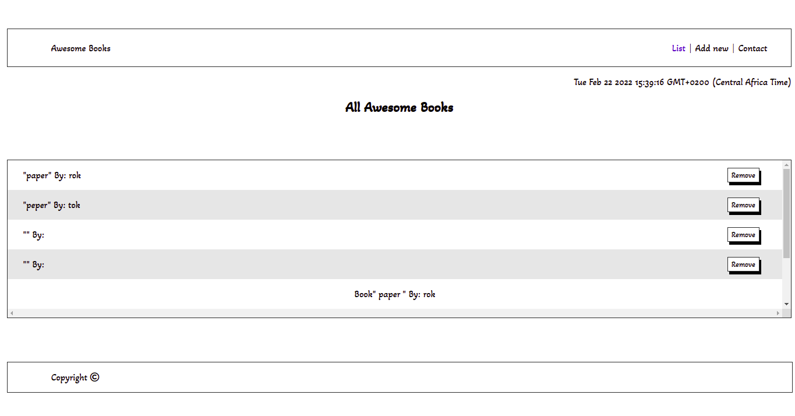

# awesome-books-project-modules


# Awesome books: plain JavaScript with objects

> This my awesome books project using modules to separate JavaScript files into small chunks. 

.

## Built With

- HTML
- CSS
- JavaScript ES6/Modules
- Visual Studio Code.
- Linters

## Live Demo

[github page](https://github.com/moise-mulungu/my-awesome-books-modules)

[live demo](http://127.0.0.1:5501/index.html)

## Getting Started

To get a local copy of this app you can use :
```
git clone  https://github.com/moise-mulungu/my-awesome-books-modules
```
To make how it works, use live-server from your local.

in this app, you can open three different pages, with an update time which runs perfectly, when you add a book it automatically adds itself on the list.

## Author

👤 **Moise Mulungu**

- GitHub: [Moise Mulungu](https://github.com/moise-mulungu)
- Twitter: [Moise Mulungu](https://twitter.com/moise_mulungu)
- LinkedIn: [Moise Mulungu](https://www.linkedin.com/in/mo%C3%AFse-mulungu-a939831b2/)


## 🤝 Contributing

Contributions, issues, and feature requests are welcome!

Feel free to check the [issues page](https://github.com/moise-mulungu/my-awesome-books-modules/issues).


## Show your support

Give a ⭐️ if you like this project!

## 📝 License

This project is [MIT](./MIT.md) licensed.
 

